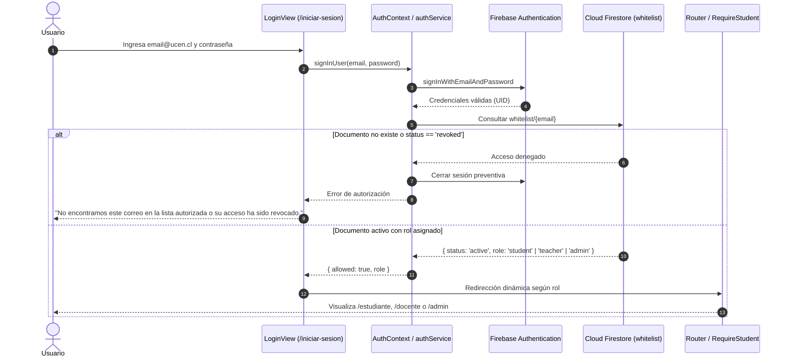

# HU-08: Inicio de sesión institucional multi-rol con Firebase

## Historia de usuario

**Como** usuario de la plataforma ReflexIA (estudiante, profesor guía o administrador),  
**quiero** iniciar sesión de forma segura con mi correo institucional `@ucen.cl` y contraseña,  
**para** acceder al espacio correspondiente a mi rol, gestionar mis actividades formativas o administrativas y resguardar la privacidad de los datos personales, sin emplear identificadores sensibles como el RUT.

---

## Criterios de aceptación

1. **Formulario unificado:** Solicita correo institucional `@ucen.cl` y contraseña.
2. **Validación en dos etapas:**
   - **Autenticación (Firebase Auth):** Valida la identidad y contraseña del usuario.
   - **Autorización (Cloud Firestore):** Verifica que el correo figure en la colección `whitelist` con estado `active` y determina su rol asignado (`student`, `teacher` o `admin`).
3. **Redirección por perfil:**
   - Rol `student` → Redirige a `/estudiante` (progreso reflexivo y talleres).
   - Rol `teacher` → Redirige a `/docente` (panel de plazos e intentos).
   - Rol `admin` → Redirige a `/admin/whitelist` (gestión de la whitelist).
4. **Protección de rutas (`RequireStudent` / `RequireAuth`):**
   - Cada ruta está protegida según `allowedRoles`.
   - Si un usuario autenticado intenta entrar a un área que no le corresponde (por ejemplo, un estudiante entrando a `/admin`), el sistema lo redirige limpiamente a la página de inicio de su respectivo rol.
   - Si no hay sesión autenticada, redirige a `/iniciar-sesion`.
5. **Observabilidad en tiempo real:** La autorización se monitorea en vivo mediante un listener de Firestore (`watchAccess`). Si un administrador revoca el acceso de un usuario, su sesión activa se cierra de manera inmediata.
6. **Privacidad estricta:** No se solicita, procesa ni almacena RUT ni datos sensibles ajenos a la actividad pedagógica (RNF-01 / RNF-02).
7. **Cierre de sesión seguro:** Cada layout (Estudiante, Docente, Admin) incluye botón **Salir** y muestra el correo del usuario activo en la cabecera.

---

## Recorrido de autenticación y autorización



---

## Arquitectura y archivos involucrados

- **`src/services/firebase.ts`**: Inicializa la aplicación Firebase (Auth y Firestore). Cuenta con valores de respaldo (*fallbacks*) de configuración pública del cliente, lo que garantiza que cualquier integrante del equipo pueda clonar el repositorio y ejecutar el entorno de desarrollo (`npm run dev`) sin necesidad de configurar un archivo `.env` manual para Firebase.
- **`src/services/authService.ts`**: Administra los métodos de inicio de sesión (`signInWithEmailAndPassword`) y cierre de sesión (`signOut`), traduciendo errores de Firebase a mensajes amigables y resolviendo el rol del usuario desde la whitelist.
- **`src/services/whitelistService.ts`**: Gestiona las operaciones de verificación individual (`checkAccess`), escucha en tiempo real (`watchAccess`), consultas, altas y revocaciones contra la colección `whitelist` de Firestore.
- **`src/context/AuthContext.tsx` y `src/hooks/useAuth.ts`**: Proveen el estado de autenticación (`status`, `user`, `role`, `error`) a toda la aplicación React.
- **`src/components/RequireStudent.tsx` (alias `RequireAuth`)**: Guarda de rutas que valida que el usuario esté autenticado y que su rol pertenezca a `allowedRoles`.
- **`src/views/auth/LoginView.tsx`**: Formulario institucional accesible, con validación de dominio institucional y redirección por rol.
- **`src/utils/userStorage.ts`**: Aísla el almacenamiento local de borradores e intentos de talleres por el `uid` del usuario de Firebase, previniendo colisiones entre cuentas distintas en el mismo navegador y protegiendo la lectura ante recargas de página (F5).
- **`firestore.rules`**: Reglas de seguridad que rigen la lectura y escritura en la base de datos Firestore.

---

## Configuración de Firebase y Variables de Entorno

El cliente web de Firebase está preconfigurado para el entorno del proyecto. No obstante, si se desea conectar a un proyecto propio o sobreescribir los valores por variables de entorno:

1. Habilita **Authentication → Email/Password** en Firebase Console.
2. Crea la base de datos **Cloud Firestore**.
3. (Opcional) Copia `.env.example` a `.env` y define las variables:

```dotenv
VITE_FIREBASE_API_KEY=tu_api_key
VITE_FIREBASE_AUTH_DOMAIN=tu_auth_domain
VITE_FIREBASE_PROJECT_ID=tu_project_id
VITE_FIREBASE_STORAGE_BUCKET=tu_storage_bucket
VITE_FIREBASE_MESSAGING_SENDER_ID=tu_sender_id
VITE_FIREBASE_APP_ID=tu_app_id
```

> **Nota:** La única clave privada que requiere confidencialidad absoluta es `VITE_OPENROUTER_API_KEY` (usada en HU-05 para IA). Las credenciales de Firebase Client SDK son identificadores públicos de cliente web protegidos mediante las **Reglas de Seguridad de Firestore**.

---

## Reglas de Seguridad en Cloud Firestore (`firestore.rules`)

Publica el contenido de [`firestore.rules`](./firestore.rules) desde **Firestore Database → Rules** en Firebase Console, o despliega con Firebase CLI:

```bash
firebase deploy --only firestore:rules
```

### Lógica de permisos de las reglas:
- **Lectura individual:** Cualquier usuario autenticado puede leer únicamente su propio documento en la whitelist (`request.auth.token.email.lower() == email`), lo que permite que estudiantes y docentes verifiquen su rol y estado de autorización activa.
- **Administración completa:** Solo usuarios administradores pueden listar, crear, modificar o revocar documentos en la colección `whitelist`. Se reconoce como administrador a:
  - Cuentas con el custom claim `admin: true`.
  - El correo institucional autorizado `admin@ucen.cl`.
  - Cuentas cuyo documento de whitelist tenga `role == 'admin' && status == 'active'`.

---

## Alta y habilitación de usuarios por rol

Debido a que no existe registro público por motivos de seguridad institucional, para dar de alta a un usuario se deben realizar dos pasos en Firebase Console:

### 1. Crear credenciales en Firebase Authentication
En **Authentication → Users → Add user**:
- **Email:** correo institucional `@ucen.cl` (ej: `alumno@ucen.cl`, `docente@ucen.cl`, `admin@ucen.cl`).
- **Password:** contraseña institucional o provisional (mínimo 6 caracteres).

### 2. Registrar autorización en Cloud Firestore
En **Firestore Database → colección `whitelist`**:
- **ID del documento:** Correo en minúsculas (ej: `alumno@ucen.cl`).
- **Campos:**

```json
{
  "email": "alumno@ucen.cl",
  "role": "student",
  "status": "active",
  "addedAt": "2026-10-05T12:00:00.000Z",
  "revokedAt": null
}
```

> **Valores posibles para el campo `role`:**
> - `"student"`: Acceso exclusivo a `/estudiante` (Marco teórico y talleres).
> - `"teacher"`: Acceso exclusivo a `/docente` (Plazos e intentos).
> - `"admin"`: Acceso a `/admin/whitelist` (Gestión autónoma de la whitelist).

---

## Comprobación y Verificación Local

```bash
# Comprobación estricta de tipos TypeScript
npm run lint

# Compilación de producción
npm run build

# Servidor de desarrollo
npm run dev
```

El flujo completo puede probarse con las tres cuentas de prueba configuradas en Firestore:
- `alumno@ucen.cl` → ingresa a `/estudiante`
- `docente@ucen.cl` → ingresa a `/docente`
- `admin@ucen.cl` → ingresa a `/admin/whitelist`
